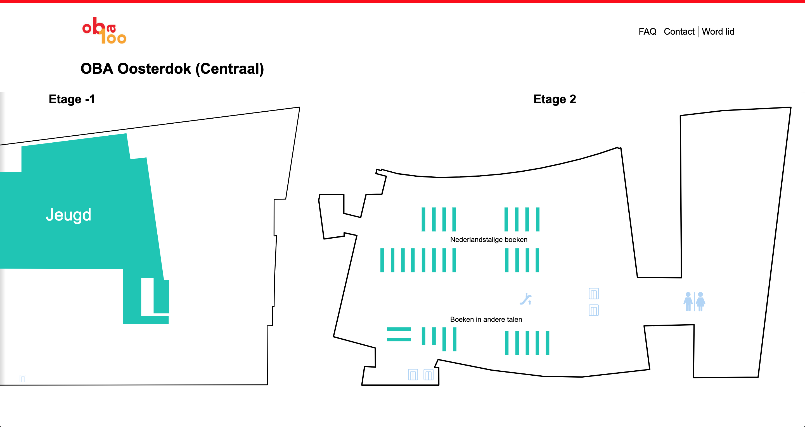

# Project 1 @cmda-minor-web · 2018-2019

## Table of Contents

1. [Live demo 🚀](#live-demo)
2. [Installation](#installation)
    1. [Pre-install](#pre-install)
    2. [Install](#install)
3. [Features 🔥](#features)
4. [Future enhancements](#future-enhancements)
5. [Technologies used 📦](#technologies-used)
6. [License](#license)

## Live demo

[🚀  Demo link  🚀](https://minor-web-project-1.netlify.com)

## Installation

### Pre-install

* Make sure to install [yarn](https://yarnpkg.com/en/) or [npm](https://www.npmjs.com).
* Make sure the **port** specified in the [package.json](client/package.json) is available (defaults to 3000).

### Install

* Clone the repository: `git clone git@github.com:Maikxx/project-1-1819.git`.
* Navigate into the directory: `cd project-1-1819`.
* Install dependencies: `yarn` or `npm install`.
* Start the client with: `yarn start-client` or `npm run start-client`.

To build the client run: `yarn build-client` or `npm run build-client`.

## Concept

The ability to explore content of the OBA is pretty poor, especially when looking at a certain location of the OBA in specific.

I choose to create a map with all the locations of the OBA on it, where you would select a location of your choice, or accept the one that is nearest to your current location.

1. When you select a location, you get to see a stacked view of floorplans, in order of floor level.
2. You will now see a floor where you can explore the contents of this floor, split up in areas (for example Greek books).
3. When you click on a section, you get taken to a page which shows you suggestions. On this page you can also search by text for related books of within this topic. The books that are shown on this page are always available in this vicinity.
4. You can click on a item as usual, which takes you to the detail page of this item.

## Features

* Render a map with all the OBA locations on it.
* Get to see the floors of that OBA location side by side.
* Interact with the floor, you can see where toilets, elevators and escalators are, as well as the general gist of where content can be found on a certain floor.
* Once interacted with the content desired, you get sent to a page which shows you a list of suggestions which correspond to the type and other features of that content.
* Once you have found something fun, which you want to learn more about, you can click on it, to see all of it's features and details, as well as where to find it and where it is available.
* Free search the API.
* Error toast.

## Future enhancements

* Add support for other locations of OBA libraries.
* Add more of the floors of the Oosterdok location.

## Technologies used

* [Autoprefixer](https://www.npmjs.com/package/autoprefixer).
* [BabelJS](https://babeljs.io).
* [Concurrently](https://www.npmjs.com/package/concurrently).
* [Navigo](https://github.com/krasimir/navigo).
* [ParcelJS](https://parceljs.org).
* [TypeScript](https://www.typescriptlang.org).
* [Wait-on](https://www.npmjs.com/package/wait-on).
* [Yarn](https://yarnpkg.com/en/).

## License

This repository is licensed as [MIT](LICENSE) by [Maikel van Veen](https://github.com/maikxx).